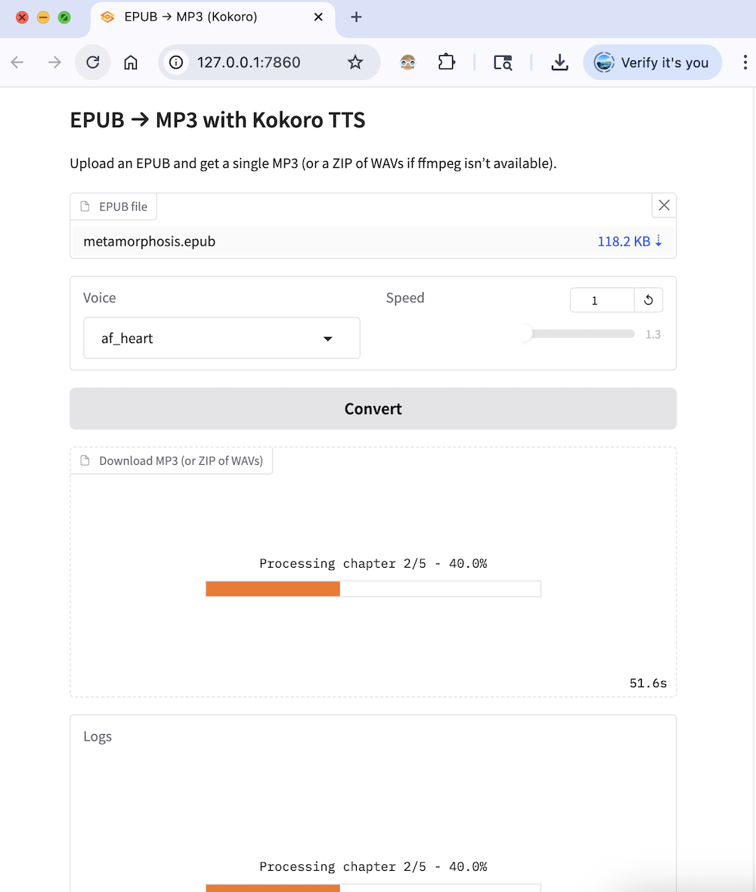

# kokoro-epub

> [!IMPORTANT]
**This tool is intended for use with non-DRM, legally acquired eBooks only.** <br>
The authors are not responsible for any misuse of this software or any resulting legal consequences. <br>

Convert EPUB to audiobook using Python.



## Quick Start

```bash
# Setup
python3.11 -m venv venv
source venv/bin/activate
pip install -r requirements.txt

# Run
python app.py
```

### GPU Torch

Kafka - Meta 25152 words

5060 Ti 16GB - ETA 194s | WPS 129.6
vs
CPU - ?

```bash
 pip install --upgrade torch --index-url https://download.pytorch.org/whl/cu128
```

## Sample Output

<video src='https://github.com/user-attachments/assets/cd229d05-e59a-4e91-becf-4b3de1859607
' width=180></video>

## Related Projects

If you're exploring other ebook-to-audio solutions, you might also check out:  
- [readest](https://github.com/readest/readest) - modern e-reader with Edge TTS (22 voices)
- [audiblez](https://github.com/santinic/audiblez) — CLI tool for converting text to audiobooks.  
- [ebook2audiobook](https://github.com/DrewThomasson/ebook2audiobook) — Simple Python-based ebook-to-audio converter.  

## License

MIT License. See [LICENSE.md](./LICENSE.md).
