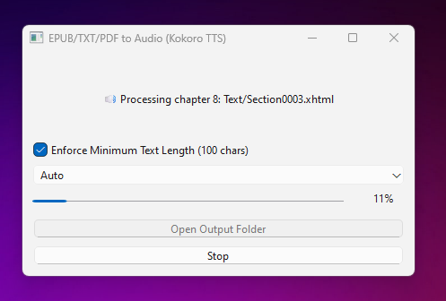

# kokoro-epub

> **Disclaimer:** Only use material from the public domain.

Convert EPUB, TXT, or PDF files to audio using Python and PyQt.

Works on **Windows** and **macOS**.



## Quick Start

```bash
# Setup
python3.11 -m venv kokoro-env
source kokoro-env/bin/activate
pip install -r requirements.txt

# Run
cd app
python pyqt_app.py
```

## Sample Output

A sample audio file generated by this project is included:

- [assets/sun_also_sample.mp3](assets/sun_also_sample.mp3)

You can play this file to hear an example of the audio output produced by the application.

The text source for this sample is available from Project Gutenberg:

- [The Sun Also Rises](https://www.gutenberg.org/cache/epub/67138/pg67138-images.html)

- The PyQt app lets you choose CPU or GPU (CUDA) for processing if you have an NVIDIA GPU and CUDA-enabled PyTorch installed. CUDA is much faster than CPU.
- `ffmpeg` is required for audio merging. On Windows, one way to install it is with `winget`.

## License

MIT License. See [LICENSE.md](./LICENSE.md).
