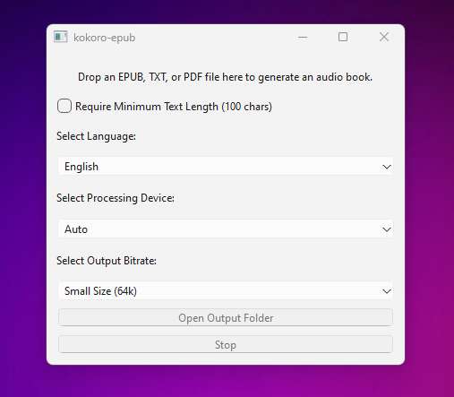

# kokoro-epub

> [!IMPORTANT]
**This tool is intended for use with non-DRM, legally acquired eBooks only.** <br>
The authors are not responsible for any misuse of this software or any resulting legal consequences. <br>
Use this tool responsibly and in accordance with all applicable laws.

Convert EPUB, TXT, or PDF files to audio using Python and PyQt.

Works on **Windows** and **macOS**.



## Quick Start

```bash
# Setup
python3.11 -m venv venv
source venv/bin/activate
pip install -r requirements.txt

# Run
cd app
python pyqt_app.py
```

## Sample Output

<video src='https://github.com/user-attachments/assets/cd229d05-e59a-4e91-becf-4b3de1859607
' width=180></video>

Spanish Example:

<video src='https://github.com/user-attachments/assets/6f9f8295-ba3e-4e00-97bf-7b94e740c2b1' width=180></video>

- The PyQt app lets you choose CPU or GPU (CUDA) for processing if you have an NVIDIA GPU and CUDA-enabled PyTorch installed. CUDA is much faster than CPU.
- `ffmpeg` is required for audio merging. On Windows, one way to install it is with `winget`.

# Docker
```bash
docker run --rm \
  -v "$PWD/app/input:/app/input" \
  -v "$PWD/app/output:/app/output" \
  kokoro-epub \
  python app/cli.py epub input/meta.epub --out /app/output --merge
```

## Related Projects

If you're exploring other ebook-to-audio solutions, you might also check out:  
- [readest](https://github.com/readest/readest) - modern e-reader with Edge TTS (22 voices)
- [audiblez](https://github.com/santinic/audiblez) — CLI tool for converting text to audiobooks.  
- [ebook2audiobook](https://github.com/DrewThomasson/ebook2audiobook) — Simple Python-based ebook-to-audio converter.  

## License

MIT License. See [LICENSE.md](./LICENSE.md).
